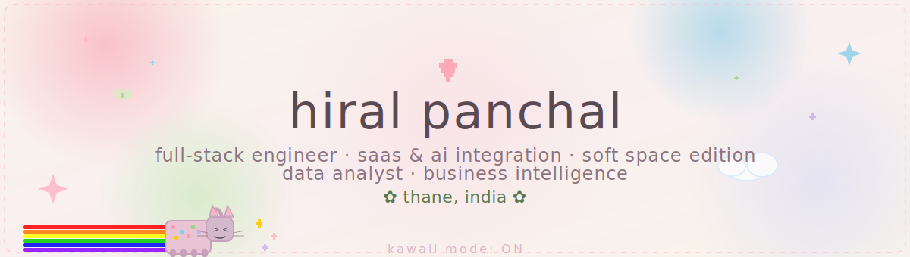

## hi there 👋🏻

<!--
**m3owbisi/m3owbisi** is a ✨ _special_ ✨ repository because its `README.md` (this file) appears on your GitHub profile.

Here are some ideas to get you started:

- 🔭 I’m currently working on ...
- 🌱 I’m currently learning ...
- 👯 I’m looking to collaborate on ...
- 🤔 I’m looking for help with ...
- 💬 Ask me about ...
- 📫 How to reach me: ...
- 😄 Pronouns: ...
- ⚡ Fun fact: ...
-->

  

<h3 align="center">hello, world'!? ˚ʚ♡ɞ˚</h3>

  
  
  

 

### ‎ ⋆｟ about me ｠⋆
- 🔭 building my personal portfolio — full-screen webp hero, scrollytelling, 11 sections
- 🌱 deepening data engineering, devops &amp; cloud infra
- 💌 actively looking for full-stack, data engineering, or devops/cloud roles
- ☁️ side project: **glorie**, a small affiliate content brand across pinterest &amp; instagram
- ♡ this readme's aesthetic is named after that side project's mood board — soft space 

- 🎧 curating playlists across genres &amp; languages — music's a constant
- 💄 into makeup, henna, hairstyles &amp; recreating lookbook fits for fun
- 📖 reading books/poems &amp; quotes on femininity, collecting life lessons from them
- 🏋🏻‍♀️ keep fitness simple — home workouts, no-equipment cardio
- ✈️ slowly working through a long travel checklist
- 🎨 used to sketch anime/kpop fanart, dabbled in photography
- 🎬 edits &amp; trends on ig, used to act/dance a little
- 🎮 gaming + streaming on the side, also love a good k-drama/anime binge
- 🌸 picked up bits of korean, japanese &amp; chinese — language curiosity runs deep 

### ‎ ⋆｟ connect with me ｠⋆

  
  
  
  

 

### ‎ ⋆｟ tech stack ｠⋆
**core**

  
  
  
  
  
  

**data &amp; analytics**

  
  
  
  
  

**devops &amp; infra**

  
  
  
  
  

 

### ‎ ⋆｟ currently shipping ｠⋆
| project | what it is |
|---|---|
| [protein bind](https://protein-bind-v7.vercel.app) | real-time collaborative research platform · next.js, typescript, ably |
| [cybershield](https://youtu.be/356-4RFTUBk) | 4-agent ai cybersecurity platform · best cyber security project award |
| ci/cd pipeline | jenkins + docker automated build-to-deploy pipeline | 

### ‎ ⋆｟ github stats ｠⋆

  
  

 

  thanks for stopping by ♡

