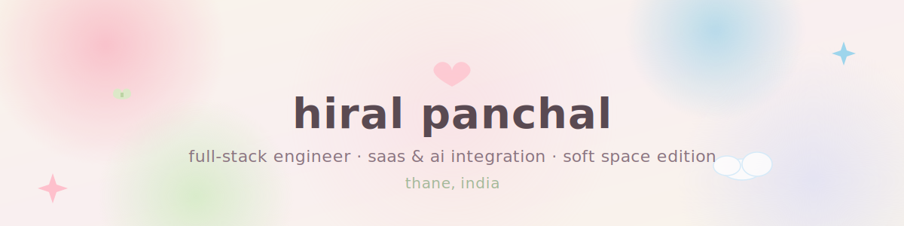

## hi there 👋

<!--
**m3owbisi/m3owbisi** is a ✨ _special_ ✨ repository because its `README.md` (this file) appears on your GitHub profile.

Here are some ideas to get you started:

- 🔭 I’m currently working on ...
- 🌱 I’m currently learning ...
- 👯 I’m looking to collaborate on ...
- 🤔 I’m looking for help with ...
- 💬 Ask me about ...
- 📫 How to reach me: ...
- 😄 Pronouns: ...
- ⚡ Fun fact: ...
--><div align="center">
  
</div>

<h3 align="center">
  
</h3>

<p align="center">
  
  &nbsp;
  
  &nbsp;
  
</p>

<br/>

---

### ‎ ⋆｟ about me ｠⋆


```
✦ full-stack engineer · saas & ai integration · thane, india
✦ currently: building my portfolio & job hunting ˚ʚ♡ɞ˚
✦ side quest: glorie — an affiliate content brand on pinterest & ig
```

**the real me, though —**

🎵 i live inside playlists — different genres, moods, languages, eras. music is how i map my feelings.

🪞 beauty is one of my love languages — makeup looks, hair experiments, henna designs, outfit styling, lookbooks — i recreate and create, both.

📖 i read about femininity like it's a whole subject — articles, blogs, poems, novels, quotes. i collect perspectives like others collect songs.

🌍 travel checklist? long and intentional. bucket list? longer.

🍜 food explorer. always trying something new.

🎌 deep in the rabbit hole of j-dramas, k-dramas, c-dramas, anime, manga, manhwa. fanart? i sketch sometimes.

📸 photography appreciator. culture proud. ig edits & trends still happen.

💃 once a dancer, always a dancer — three years of it lives in my body.

🎮 i stream games and i play them. both are valid.

🏋️ gym sets at home, cardio when the mood hits. health-conscious but make it cozy.

<br/>

<div align="center">

```
˚₊‧꒰ა ☆ ໒꒱ ‧₊˚   ✦ ₊˚ʚ ᗢ₊˚✧ ゚.   ꒰ঌ໒꒱ ₊˚
```

</div>

---

### ‎ ⋆｟ connect with me ｠⋆

<p align="left">
  <a href="https://linkedin.com/in/hiral-panchal-b89071294">
    
  </a>
  <a href="mailto:hp0505157@gmail.com">
    
  </a>
  <a href="https://github.com/m3owbisi">
    
  </a>
  <a href="https://www.instagram.com/m3owbisi">
    
  </a>
</p>

<br/>

---

### ‎ ⋆｟ tech stack ｠⋆

**core**

<p align="left">
  
  
  
  
  
  
</p>

**data & analytics**

<p align="left">
  
  
  
  
  
</p>

**devops & infra**

<p align="left">
  
  
  
  
  
</p>

<br/>

---

### ‎ ⋆｟ currently shipping ｠⋆


| project | what it is |
|---|---|
| [protein bind](https://protein-bind-v7.vercel.app) | real-time collaborative research platform · next.js, typescript, ably |
| [cybershield](https://youtu.be/356-4RFTUBk) | 4-agent ai cybersecurity platform · best cyber security project award 🏆 |
| ci/cd pipeline | jenkins + docker automated build-to-deploy pipeline |

<br/>

---

### ‎ ⋆｟ github stats ｠⋆

<p align="center">
  
  
</p>

<br/>

---

<div align="center">

```
₊˚ʚ ᗢ₊˚✧  ﾟ ꒰ঌ ♡ ໒꒱  ˚₊· ͟͟͞͞➳❥  ₊˚ʚ ᗢ₊˚✧  ﾟ
```


*thanks for stopping by ♡ come back soon ˚ʚ♡ɞ˚*

</div>
